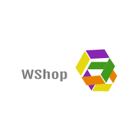

=====
Wshop
=====

-----------------------------------
Domain-driven e-commerce for Django
-----------------------------------

Wshop is an e-commerce framework for building domain-driven applications. It
has flexibility baked into its core so that complicated requirements can be
elegantly captured. You can tame a spaghetti domain without writing spaghetti
code.

Years of e-commerce hard-earned experience informs Wshop's design.

Wshop is "domain-driven" in the sense that the core business objects can be
customised to suit the domain at hand. In this way, your application can
accurately capture the subtleties of its domain, making feature development and
maintenance much easier.

Features:

* Any product type can be handled including downloadable products,
  subscriptions, child products (e.g., a T-shirt in different sizes and colours).

* Customisable products, such as T-shirts with personalised messages.

* Large catalogue support - Wshop is used in production by sites with
  more than 20 million products.

* Multiple fulfillment partners for the same product.

* A range of merchandising blocks for promoting products throughout your site.

* Sophisticated offers that support virtually any kind of offer you can think
  of - multi-buys, bundles, buy X get 50% off Y etc

* Vouchers (built on top of the offers framework)

* Comprehensive dashboard that replaces the Django admin completely

* Support for complex order processing such split payment orders, multi-batch
  shipping, order status pipelines.

* Extension libraries available for many payment gateways, including PayPal_,
  GoCardless_, DataCash_ and more.

.. _PayPal: https://github.com/wshop-core/wshop-paypal
.. _GoCardless: https://github.com/vituocgia/wshop-core-gocardless
.. _DataCash: https://github.com/vituocgia/wshop-core-datacash

Wshop is a good choice if your domain has non-trivial business logic.  Wshop's
flexibility means it's straightforward to implement business rules that would be
difficult to apply in other frameworks.  

Example requirements that Wshop projects already handle:

* Paying for an order with multiple payment sources (e.g., using a bankcard,
  voucher, gift card and points account).

* Complex access control rules governing who can view and order what.

* Supporting a hierarchy of customers, sales reps and sales directors - each
  being able to "masquerade" as their subordinates.

* Multi-lingual products and categories.

* Digital products.

* Dynamically priced products (eg where the price is provided by an external
  service).

Wshop is used in production in several applications to sell everything from beer
mats to iPads.  The `source is on GitHub`_ - contributions are always welcome.

.. _`source is on GitHub`: https://github.com/vituocgia/wshop-core

First steps
===========
.. toctree::
   :maxdepth: 1

   internals/sandbox
   internals/getting_started
   topics/key_questions
   topics/modelling_your_catalogue
   internals/getting_help
   ref/glossary

Using Wshop
===========

All you need to start developing an Wshop project.

.. toctree::
   :maxdepth: 1

   topics/customisation
   topics/class_loading_explained
   topics/prices_and_availability
   topics/deploying
   topics/translation
   topics/upgrading
   topics/fork_app

Reference:

.. toctree::
   :maxdepth: 1

   Core functionality </ref/core>
   Wshop's apps </ref/apps/index>
   howto/index
   ref/settings
   ref/signals
   ref/templatetags

The Wshop open-source project
=============================

Learn about the ideas behind Wshop and how you can contribute.

.. toctree::
   :maxdepth: 1

   internals/design-decisions
   releases/index
   internals/contributing/index
   
